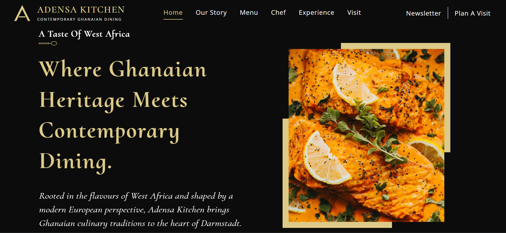

# Adensa Kitchen — Contemporary Ghanaian Dining

  

A polished digital dining experience for a contemporary Ghanaian restaurant concept in Darmstadt, Germany. The project combines **brand storytelling, UX/UI design, responsive frontend development, interactive experiences, and accessibility-focused interactions**.

### Highlights

* Contemporary Ghanaian-inspired visual identity and digital experience
* Responsive layout designed for **desktop, tablet, and mobile screens**
* Interactive menu, gallery lightbox, video experience, and reservation request flow
* Accessible navigation, keyboard interactions, focus management, and reduced-motion support
* Performance-optimized imagery and video assets

### Tech Stack

**React · JavaScript · Vite · CSS · Vercel**

### Live Demo

**[adensa-kitchen.vercel.app](https://adensa-kitchen.vercel.app/)**

### Status

**Completed · Deployed**

